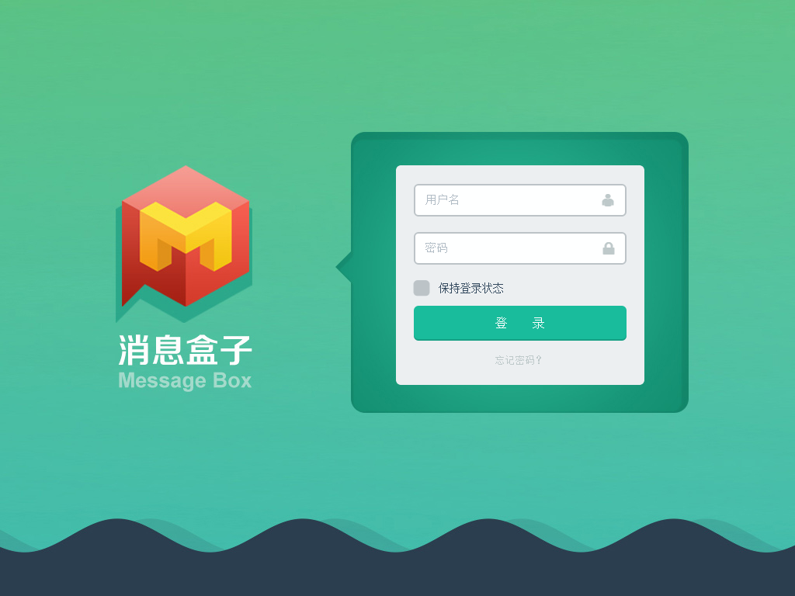

# message-box
基于Electron、Vue.js、Socket.io、MongoDB等技术搭建的消息盒子桌面客户端（Windows）

# Preview

# Usages

- `clone this repo`
- `cd message-box`
- `npm install`
- `npm start`

# Features

- [x] 搭建基本框架模板，技术栈：Node.js/Electron/Vue.js/Socket.io/Webpack/Gulp/
- [x] 三栏式设计，左侧栏为 **消息分类** ， 消息栏为 **消息摘记**  ，内容栏为 **消息内容**
- [x] 界面UI采用Flat-ui统一风格
- [x] 用户登录
- [x] 新消息监听机制
- [x] 系统桌面新消息/通知弹窗
- [x] 按消息/通知类型检索消息
- [x] 按消息/通知类型统计未读消息总数
- [x] 标记已读/未读
- [ ] 标记全部已读
- [x] 消息删除功能
- [x] 全文搜索功能
- [x] 消息显示支持markdown格式
- [x] 数据持久化支持
- [x] 系统托盘图标功能
- [ ] 本地缓存机制
- [ ] socket.io集群
- [x] 制作客户端图标
- [ ] 更换主题
- [x] 关于窗口

# Plan to do better

- [ ] 给消息/通知添加标签
- [ ] 添加webhook支持

# License
MIT
